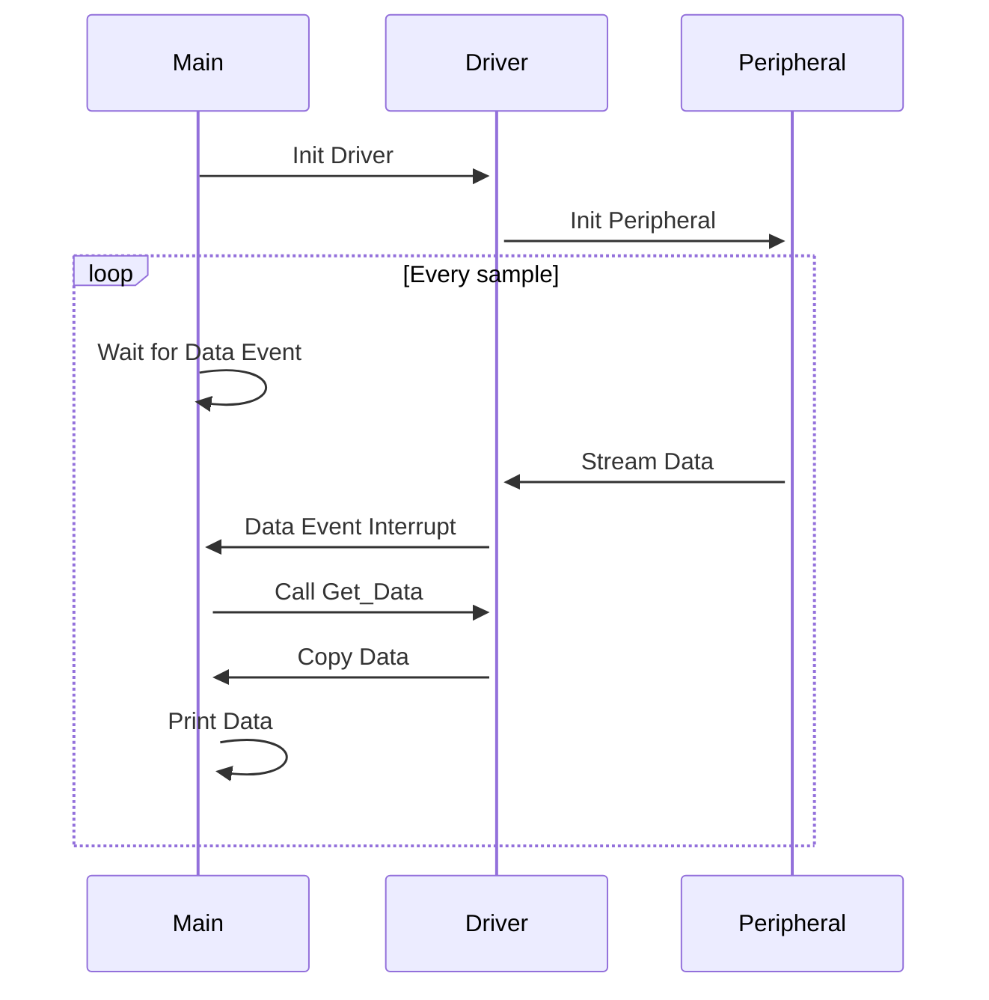
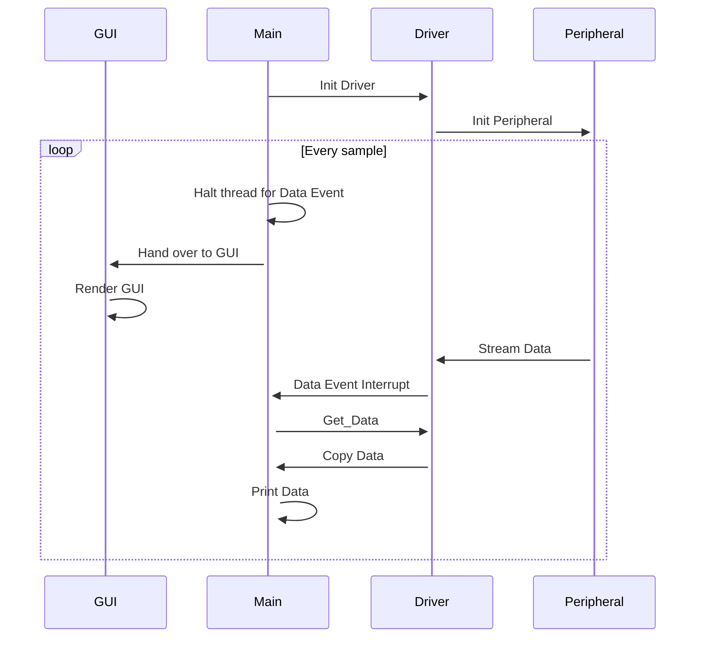
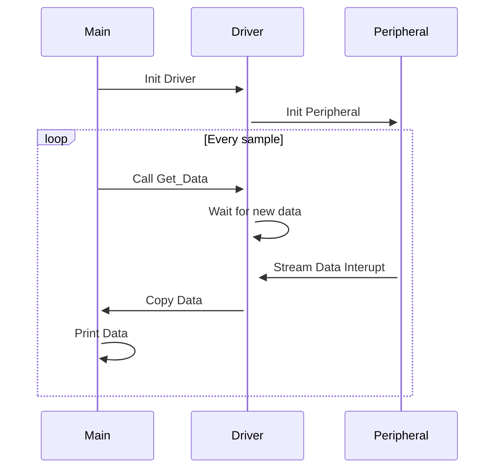

# Hello VSI example

This example uses the VSI ([Virtual Streaming Interface](https://arm-software.github.io/AVH/main/simulation/html/group__arm__vsi.html)) to simulate a peripheral sensor. The example sensor will send data in form of bytes to the application running on [Arm Virtual Hardware](https://arm-software.github.io/AVH/main/overview/html/index.html). The virtual peripheral is controlled by a python script that reads the data from a text file called `intdata.txt`. This is a minimal example of how to use Arm VSI, and you can modify the python script and the sensor driver in order to match your use case.

## Build and run

Use the cbuild tool to build the application (See the project [README](../README.md) for information on setting up the AVH environment)

All applications have been ported for Corstone-300 and Corstone-310. Replace `<platform>` with the target you would like to test.

### Application Without GUI

Streams data from the `intdata.txt` file and prints to the console. For each loop, the application will wait until it get an interrupt from the driver that a new item has been streamed, at that point the application will proceed to copy the data from a data buffer and print out to the console.

1. `csolution convert -s target/<platform>/hello_vsi.csolution.yml`
2. `cbuild --packs --rebuild target/<platform>/hello_vsi+hello_vsi.cprj`
3. `./run_example.sh`

For example, to build and run on Corstone-310, use:
```bash
csolution convert -s target/Corstone_310/hello_vsi.csolution.yml
```
```bash
cbuild --packs --rebuild target/Corstone_310/hello_vsi+hello_vsi.cprj
```
```bash
./run_example.sh -C mps3_board.visualisation.disable-visualisation=1
```

### Application With GUI

Streams data from the `intdata.txt` file and prints to the console as well as drawing a graph on the virtual display. Similarily to the application above, the application will wait for the interrupt to come before attempting to copy data. The GUI will update in a separate task while waiting for new data.
This example is refering [Arm 2D library](https://github.com/ARM-software/Arm-2D) to draw a graph on the virtual display. Need to copy Arm 2D library to [arm2d forder](source/arm2d/) before building the project.

1. `git clone https://github.com/ARM-software/Arm-2D.git -b v1.1.0 ./source/arm2d/`
2. `csolution convert -s target/<platform>/hello_vsi_gui.csolution.yml`
3. `cbuild --packs --rebuild target/<platform>/hello_vsi_gui+hello_vsi.cprj`
4. `./run_example.sh`

For example, to build and run on Corstone-310, use:
```bash
git clone https://github.com/ARM-software/Arm-2D.git -b v1.1.0 ./source/arm2d/
```
```bash
csolution convert -s target/Corstone_310/hello_vsi_gui.csolution.yml
```
```bash
cbuild --packs --rebuild target/Corstone_310/hello_vsi_gui+hello_vsi.cprj
```
```bash
./run_example.sh
```

### Gated Fetch Flow

Data will be streamed sample by sample when requested by the application. The peripheral will be paused between each data fetch. So when we do a `get_sample` call, the applicaiton will resume the peripheral, and when the data sample has finished being streamed, it will pause the peripheral again.

1. `csolution convert -s target/<platform>/hello_vsi_gated.csolution.yml`
2. `cbuild --packs target/<platform>/hello_vsi_gated+hello_vsi.cprj`
3. `./run_example.sh`

For example, to build and run on Corstone-310, use:
```bash
csolution convert -s target/Corstone_310/hello_vsi_gated.csolution.yml
```
```bash
cbuild --packs --rebuild target/Corstone_310/hello_vsi_gated+hello_vsi.cprj
```
```bash
./run_example.sh -C mps3_board.visualisation.disable-visualisation=1
```

### No Event Flow

Sample will be streamed to the application, but the aplication will not interrupt to fetch the sample data. Instead the application will naturally arrive at the data fetching, and if there is a new item available, it will be copied, otherwise the application will wait until there is a new sample available.

1. `csolution convert -s target/<platform>/hello_vsi_noevent.csolution.yml`
2. `cbuild --packs target/<platform>/hello_vsi_noevent+hello_vsi.cprj`
3. `./run_example.sh`

For example, to build and run on Corstone-310, use:
```bash
csolution convert -s target/Corstone_310/hello_vsi_noevent.csolution.yml
```
```bash
cbuild --packs --rebuild target/Corstone_310/hello_vsi_noevent+hello_vsi.cprj
```
```bash
./run_example.sh -C mps3_board.visualisation.disable-visualisation=1
```

## Explanation of Run Command Arguments

Instead of using the `run_example.sh` script, it is also possible to run the command manually, your can refer the following table for each command arguments

| Argument  | Details |
| ---       | ---     |
| `-V </path/to/python/folder>` | The directory where the python scripts that will emulate the Virtual Streaming Interface are located |
| `-f <config_file>` | Path to a configuration file for the FVP. |
| `-a <application.axf>` | The application that will run on the FVP |
| `--stat` | Print out stats about run times, cycle count, etc. at the end of the run |
| `--simlimit 24` | Limit the run to 24 simulated seconds. |
| `-C mps3_board.visualisation.disable-visualisation=1` | Disable MPS3 AVH visualisation. |

## Application flows

These diagrams shows the application flow for the different variants.

### Event Driven Flow



### Event Driven Flow (GUI)



### Gated fetch Flow



## Continuous Integration (CI)

You can use [avhclient](https://github.com/ARM-software/avhclient) to implement your CI pipeline with this example.

`avh_SSE300.yml` is a simple template to build and run this example on Arm Corstone 300 virtual hardware platform.
This yml file will launch an [AVH v1.3](https://aws.amazon.com/marketplace/pp/prodview-urbpq7yo5va7g) with [t2 micro instance type](https://aws.amazon.com/ec2/instance-types/t2/?nc1=h_ls) and upload nessasary files for building with Arm Corstone 300 platform.

| Path/Files to upload | Details |
| ---       | ---     |
| `source/*` | Project source code |
| `target/*` | Target project files |
| `intdata.txt` | External integer data for read |
| `fvp_config.txt` | Virtual hardware configure file |

Once uploading the files into AVH instnace and building , it will run the [object file](Objects/hello_vsi.axf) with Corstone 300 virtual hardware.
And the running log will be recorded with `hello_vsi.log`.

The following files will be downloaded from the instance before the instance is terminated.
| Path/Files to download | Details |
| ---       | ---     |
| `hello_vsi.log` | Running log |
| `Objects/hello_vsi+hello_vsi.axf` | Obeject file |
| `Objects/hello_vsi+hello_vsi.axf.map` | Mapping file for the object file |
| `intdata.txt` | External integer data |

Refer [here](https://arm-software.github.io/AVH/main/infrastructure/html/run_ami_github.html) to learn more about how to setup CI workflows with Github Actions.

[hello_vsi.yml](../.github/workflows/hello_vsi.yml) is the CI workflow example working with Github Actions to check the count of the number `199` in the data stream.
