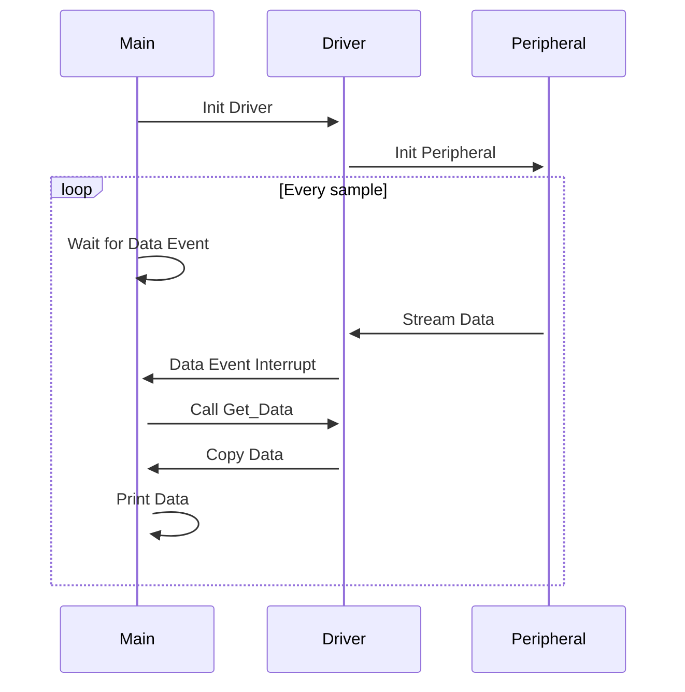
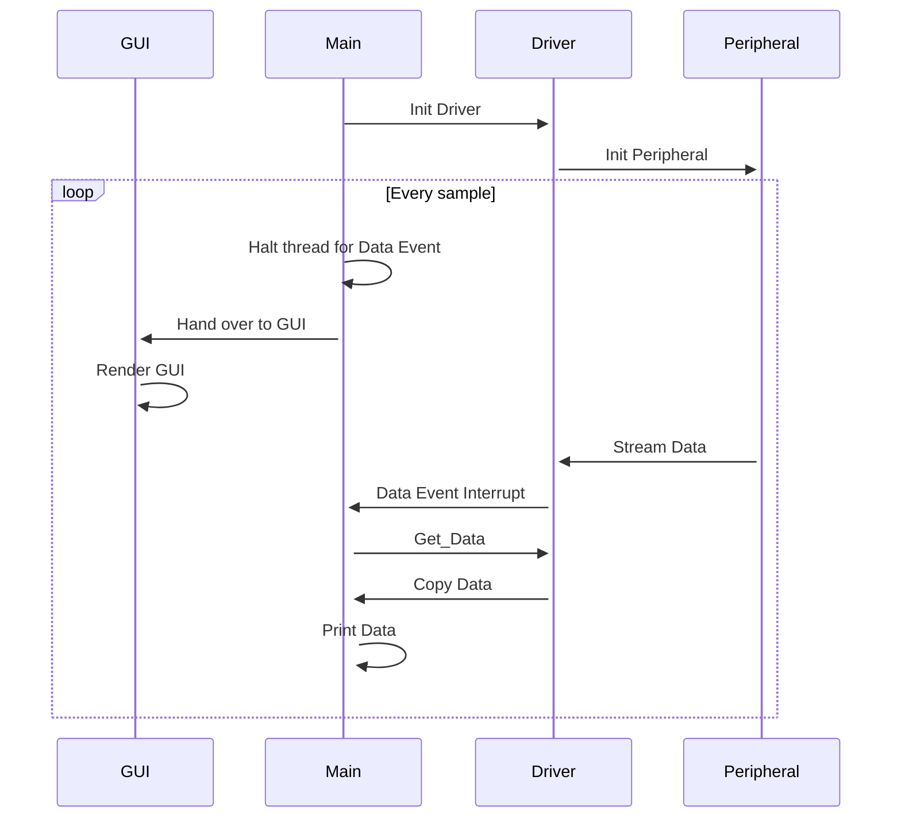
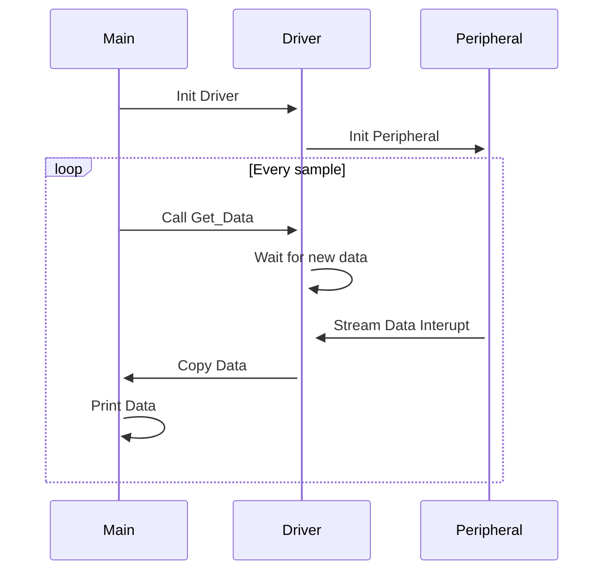

# Hello VSI example

This example uses the VSI ([https://arm-software.github.io/AVH/main/simulation/html/group__arm__vsi.html](Virtual Streaming Interface)) to simulate a peripheral sensor. The example sensor will send data in form of bytes to the application running on [https://arm-software.github.io/AVH/main/overview/html/index.html](Arm Virtual Hardware). The virtual peripheral is controlled by a python script that reads the data from a text file. This is a miniimal example of how to use Arm VSI, and you can modify the python script and the sensor driver in order to match your use case.

## Build and run

Use the cbuild tool to build the application (See the project [README](../README.md) for information on setting up the AVH environment)

All applications have been ported for Corstone-300 and Corstone-310. Replace `<platform>` with the target you would like to test.

### Application Without GUI

Basic application. Streams data from the `data.txt` file and prints to the console. For each loop, the application will wait until it get an interrupt from the driver that a new item has been streamed, at that point the application will proceed to copy the data from the data buffer and print to the console.

1. `cbuild --packs target/<platform>/hello_vsi.cprj`
2. `./run_example.sh`

### Application With GUI

Streams data from the `data.txt` file and prints to the console as wel as draws graph on the virtual display. Similarily to the application above, the application will wait for the interrupt to come before attempting to copy data. However in this case instead of halting completely, we update the GUI while waiting for new data. This can be modified to do other tasks while waiting for new data samples.

1. `cbuild --packs target/<platform>/hello_vsi_gui.cprj`
2. `./run_example.sh`

### Gated Fetch flow

Data will be streamed sample by sample when requested by the application. The data stream will be paused between each fetch. So when we do a `get_sample` call, the applicaiton will flag the peripheral to send a data sample, and when the data sample has been streamed, it will tell the peripheral to pause again.

1. `cbuild --packs target/<platform>/hello_vsi_gated.cprj`
2. `./run_example.sh`

### No Event Flow

Sample will be streamed to the application, but the aplication will not interrup to fetch the sample data. Instead the application will naturally arrice at the data fetching, and if there is a new item available, it will be copied, otehrwise the application will wait until there is a new sample streamed.

1. `cbuild --packs target/<platform>/hello_vsi_noevent.cprj`
2. `./run_example.sh`

## Run application Manually

You can also run the command manually by using the following command. Use the platform you have built application for (Corstone 300 or Corstone 310 for example)

Corstone 300:

```bash
VHT_Corstone_SSE-300_Ethos-U55 -V "./source/VSI/data_sensor/python" -f fvp_config.txt -a Objects/hello_vsi.axf --stat --simlimit 24 $*
```

Corstone 310:

```bash
VHT_Corstone_SSE-310 -V "./source/VSI/data_sensor/python" -f fvp_config.txt -a Objects/hello_vsi.axf --stat --simlimit 24 $*
```

### Explanation of Run Command Arguments

| Argument  | Details |
| ---       | ---     |
| `-V path` | The directory where the python scripts that will emulate the Virtual Streaming Interface are located |
| `-f file` | Path to a configuration file for the FVP. |
| `-a application` | The application that will wun on the FVP |
| `--stat` | Print out stats about run times, cycle count, etc. at the end of the run |
| `--simlimit 24` | Limit the run to 24 simulated seconds. |

## Application flows

These diagrams shows the application flow for the different variants.

### Event Driven Flow



### Event Driven Flow (GUI)



### Gated fetch Flow



## Continuous Integration (CI) 
You can use [avhclient](https://github.com/ARM-software/avhclient) to implement your CI pipeline with this example.

`avh_SSE300.yml` is a simple template to build and run this example on Arm Corstone 300 virtual hardware platform.
This yml file will launch an [AVH v1.3](https://aws.amazon.com/marketplace/pp/prodview-urbpq7yo5va7g) with [t2 micro instance type](https://aws.amazon.com/ec2/instance-types/t2/?nc1=h_ls) and upload nessasary files for building with Arm Corstone 300 platform.

| Path/Files to upload | Details |
| ---       | ---     |
| `source/*` | Project source code |
| `target/*` | Target project files |
| `intdata.txt` | External integer data for read |
| `fvp_config.txt` | Virtual hardware configure file |

Once uploading the files into AVH instnace and building , it will run the [object file](Objects/hello_vsi.axf) with Corstone 300 virtual hardware.
And the running log will be recorded with `hello_vsi.log`.

The following files will be downloaded from the instance before the instance is terminated.
| Path/Files to download | Details |
| ---       | ---     |
| `hello_vsi.log` | Running log |
| `Objects/hello_vsi.axf` | Obeject file |
| `Objects/hello_vsi.axf.map` | Mapping file for the object file |
| `intdata.txt` | External integer data |

Refer [here](https://arm-software.github.io/AVH/main/infrastructure/html/run_ami_github.html) to learn more about how to setup CI workflows with Github Actions.

[hello_AVH.yml](../.github/workflows/hello_AVH.yml) is the CI workflow example working with Github Actions to check the count of the number `199` in the data stream.
