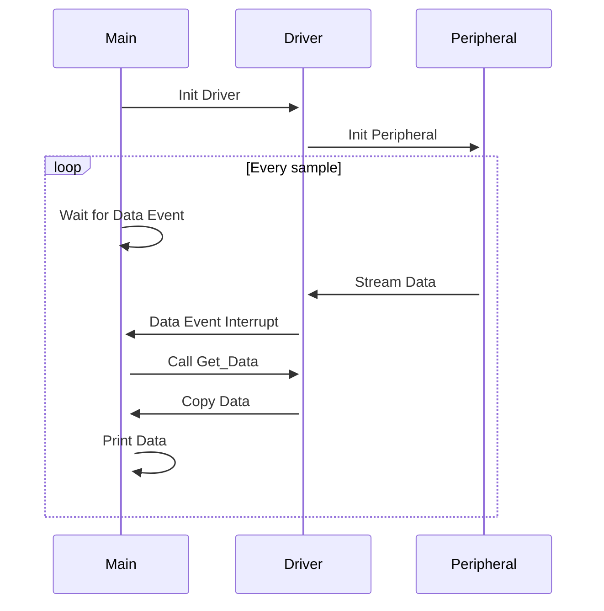
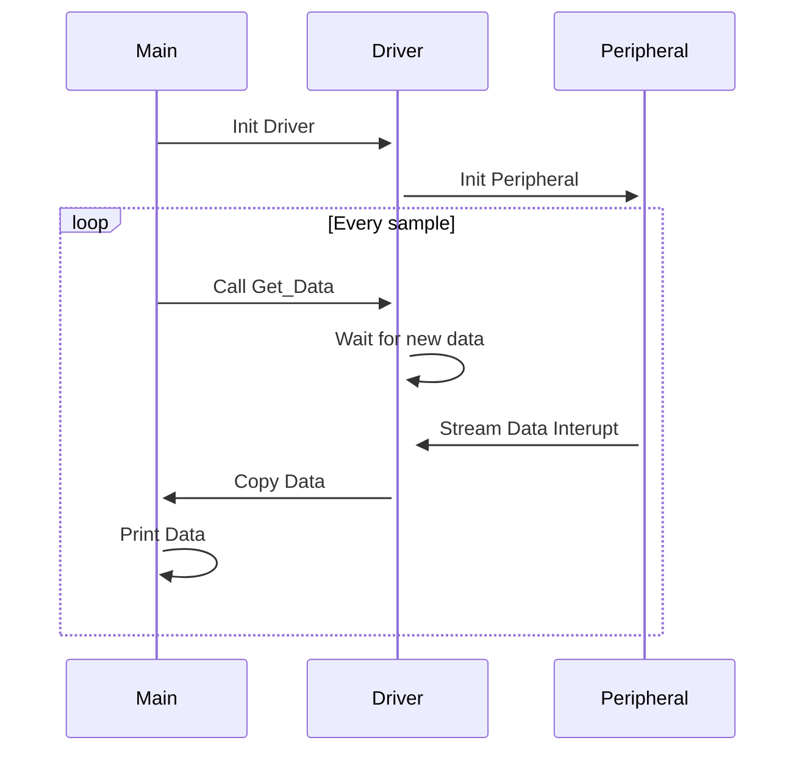

# Hello VSI example

This example uses the **VSI** ([Virtual Streaming Interface](https://arm-software.github.io/AVH/main/simulation/html/group__arm__vsi.html)) to simulate a peripheral sensor. The example sensor will send data in form of bytes to the application running on an [AVH FVP Model](https://arm-software.github.io/AVH/main/overview/html/index.html). The virtual peripheral is controlled by a python script `arm_vsi0.py` that reads the data from a text file called `intdata.txt`. This is a minimal example of how to use Arm VSI, and you can modify the python script and the sensor driver in order to match your use case.


## Application operation

The application receives sensor data from the `intdata.txt` file and prints the values to the console. For each loop, the application will wait until DMA block is filled, at that point the application will proceed to copy the data from a data buffer and print out to the console. When end of `intdata.txt` file is reached, the operation loop is stopped.

You can modify the streaming and driver operation using data and DMA parameters in `app.c` file.

The application supports **Corstone-315**, **Corstone-310** and **Corstone-300** targets, and can be compiled with **Arm Compiler 6** or **GCC**.

See **Application flows** below for additional details.

## Build

Use the cbuild tool or an IDE to build the application project in csolution format (see the main [README](../README.md)).

The build context is contructed as flow type (such as `.event`) and target type (such as `+Corstone_315`). To compile with **AC6** use `--toolchain AC6` and for **GCC** the `--toolchain GCC` option with the cbuild command. For example:

To build the project for **Corstone-315** target with GCC compiler use:

```bash
cbuild hello_vsi.csolution.yml --packs --rebuild --toolchain GCC --context .event+Corstone_315
```

To build with the gated fetch flow for the **Corstone-310** target and Arm Compiler 6: 

```bash
cbuild hello_vsi.csolution.yml --packs --rebuild --toolchain AC6 --context .gated+Corstone_310
```

## Run

To run the application from command line, use corresponding AVH FVP and provide the path to the binary image as well as the VSI python scripts. Also see the main [README](../README.md) for details.

For example:

To run on the Corstone -315 the event-based firmware built with GCC compiler, with exit after running 40 seconds (wall-time), use:

```bash
FVP_Corstone_SSE-315 -a ./out/hello_vsi/Corstone_315/event/GCC/hello_vsi.elf -C mps4_board.v_path=./source/vsi/data_sensor_py/ --timelimit 40
```

For a target Corstone-310 with gated fetch flow built with Arm Compiler 6 and exit after 60 seconds of execution:

```bash
FVP_Corstone_SSE-310 -a ./out/hello_vsi/Corstone_310/gated/AC6/hello_vsi.axf -C mps3_board.v_path=./source/vsi/data_sensor_py/ --timelimit 40
```


## Application flows

The sections below explain the application flows for the supported build types.

### Event Driven Flow

Sensor data is continuously streamed from the sensor. When DMA block is filled with data a sensor event is triggered, the block is copied and application prints obtained values into the console.

Use `.event` as the build type, followed by the target platform.



### Gated fetch Flow

Sensor data is fetched only when requested so by the application. The peripheral will be paused between each data fetch.

Use `.gated` as the build type, followed by the target platform.


