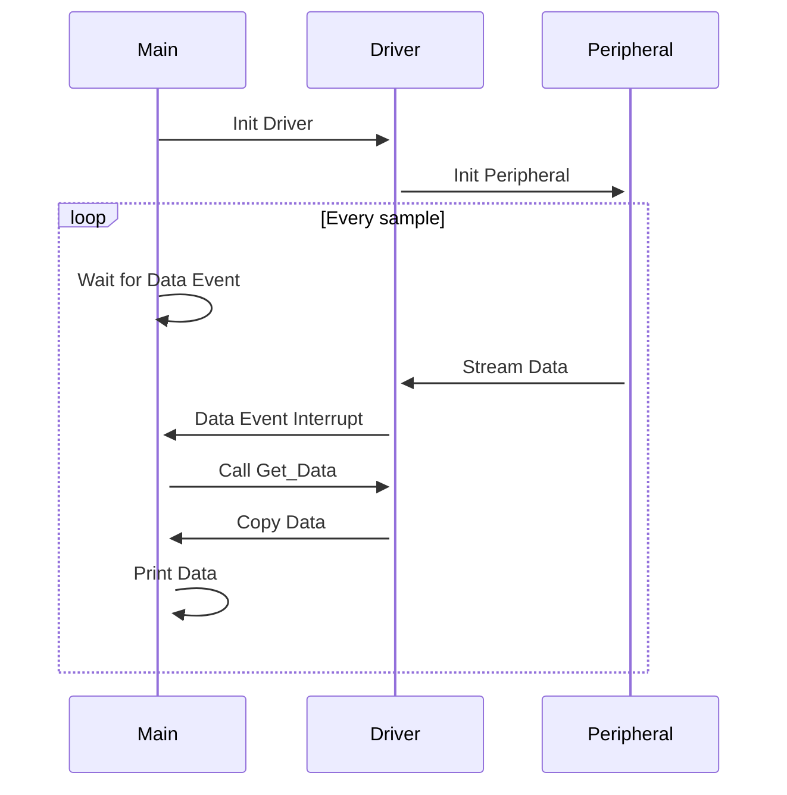
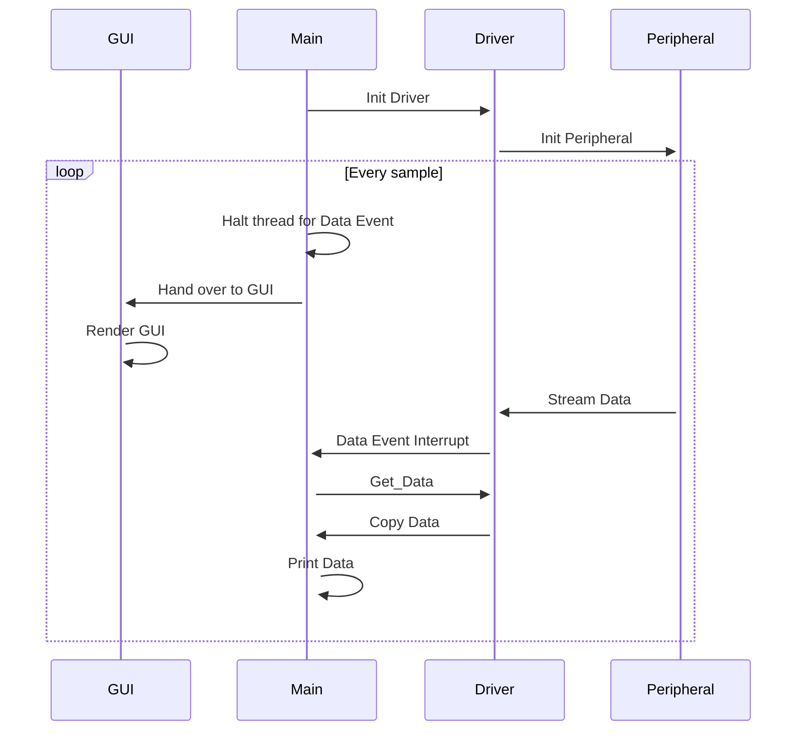
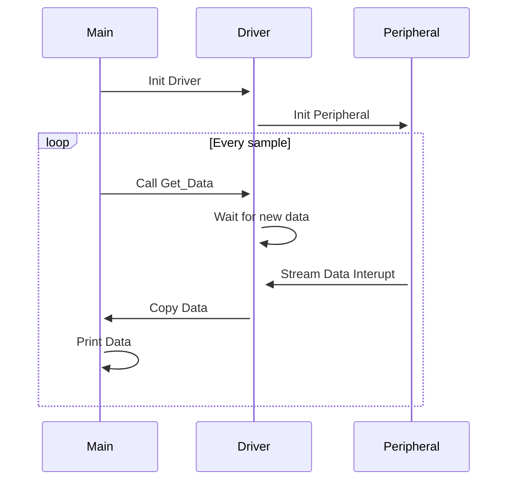

# Hello VSI example

This example uses the **VSI** ([Virtual Streaming Interface](https://arm-software.github.io/AVH/main/simulation/html/group__arm__vsi.html)) to simulate a peripheral sensor. The example sensor will send data in form of bytes to the application running on [AVH FVP Models](https://arm-software.github.io/AVH/main/overview/html/index.html). The virtual peripheral is controlled by a python script that reads the data from a text file called `intdata.txt`. This is a minimal example of how to use Arm VSI, and you can modify the python script and the sensor driver in order to match your use case.

## Build and run

Use the cbuild tool or an IDE to build the application project in csolution format (See the project [README](../README.md).

All applications have been ported for **Corstone-300**, **Corstone-310** and **Corstone-315**, and can be compiled with **Arm Compiler** 6 or **GCC**. By default the Arm Compiler 6 is used, to compile with GCC, use `--toolchain GCC` option for the cbuild command.


### Application Without GUI

Streams data from the `intdata.txt` file and prints to the console. For each loop, the application will wait until it get an interrupt from the driver that a new item has been streamed, at that point the application will proceed to copy the data from a data buffer and print out to the console.

Use `.event` as the build type, followed by the target platform. For example:

To build the **Corstone-310** target with **GCC** use: 

```bash
cbuild hello_vsi.csolution.yml --context-set --update-rte --packs --context hello_vsi.event+Corstone_310 --toolchain GCC
```

To build the **Corstone-300** target with **AC6** (default toolchain): 

short form
```bash
cbuild hello_vsi.csolution.yml --update-rte --packs --context hello_vsi.event+Corstone_300
```

or more specific

```bash
cbuild hello_vsi.csolution.yml --update-rte --packs --context hello_vsi.event+Corstone_300 --toolchain AC6
```

To run a specific context:

**Corstone_310** target which has been build with **GCC** use:

```bash
FVP_Corstone_SSE-310 -a ./out/hello_vsi/Corstone_310/event/hello_vsi.elf -C mps3_board.v_path=./source/VSI/data_sensor/python/ --simlimit 60
```


**Corstone_300** target which has been build with **AC6** use:

```bash
FVP_Corstone_SSE-300 -a ./out/hello_vsi/Corstone_300/event/hello_vsi.axf -C mps3_board.v_path=./source/VSI/data_sensor/python/ --simlimit 60
```


### Gated Fetch Flow

Data will be streamed sample by sample when requested by the application. The peripheral will be paused between each data fetch. So when we do a `get_sample` call, the applicaiton will resume the peripheral, and when the data sample has finished being streamed, it will pause the peripheral again.

Use `.gated` as the build type, followed by the target platform. For example, to build and run on Corstone-310, use:

```bash
cbuild hello_vsi.csolution.yml -c .gated+Corstone_310 --packs --update-rte --toolchain AC6
```


```bash
FVP_Corstone_SSE-310 -a ./out/hello_vsi/Corstone_310/event/hello_vsi.axf -C mps3_board.v_path=./source/VSI/data_sensor/python/
```

### No Event Flow

Sample will be streamed to the application, but the aplication will not interrupt to fetch the sample data. Instead the application will naturally arrive at the data fetching, and if there is a new item available, it will be copied, otherwise the application will wait until there is a new sample available.

Use `.noevent` as the build type, followed by the target platform. For example, to build and run on Corstone-310, use:

Compile: 

```bash
cbuild hello_vsi.csolution.yml -c .noevent+Corstone_310 --packs --update-rte
```

Run:

```bash
FVP_Corstone_SSE-310 -a ./out/hello_vsi/Corstone_310/event/hello_vsi.axf -C mps3_board.v_path=./source/VSI/data_sensor/python/
```


## Application flows

These diagrams shows the application flow for the different variants.

### Event Driven Flow



### Event Driven Flow (GUI)



### Gated fetch Flow


